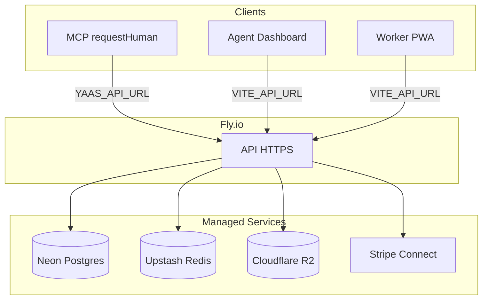

# YAAS Deployment Guide

Deploy YAAS to public HTTPS endpoints before connecting MCP clients or mobile workers. Localhost is for solo development only.

## URL Topology

| Component | Env var | Example |
|-----------|---------|---------|
| API | `PUBLIC_API_URL` | `https://yaas-api.fly.dev` |
| Agent dashboard | `VITE_API_URL` (build time) | `https://agents.your-domain.com` |
| Worker PWA | `VITE_API_URL` (build time) | `https://workers.your-domain.com` |
| MCP client | `YAAS_API_URL` | Same as API public URL |
| Proof storage | `R2_PUBLIC_URL` | `https://proofs.your-cdn.com` |
| Stripe Connect return | `WORKER_APP_URL` | `https://workers.your-domain.com` |



## Recommended Hosting

| Layer | Service | Notes |
|-------|---------|-------|
| API + BullMQ | [Fly.io](https://fly.io) | Use [`fly.toml`](../fly.toml) and [`apps/api/Dockerfile`](../apps/api/Dockerfile) |
| PostgreSQL | [Neon](https://neon.tech) | Connection pooling recommended |
| Redis | [Upstash](https://upstash.com) | Required for BullMQ queues |
| Proof media | [Cloudflare R2](https://developers.cloudflare.com/r2/) | Set `R2_PUBLIC_URL` for agent-fetchable proof links |
| Agent dashboard | [Cloudflare Pages](https://pages.cloudflare.com) | Build with `VITE_API_URL` |
| Worker PWA | Cloudflare Pages | Build with `VITE_API_URL` |

## Step-by-Step

### 1. Configure environment

Copy [`.env.example`](../.env.example) and fill in production values:

```bash
cp .env.example .env
```

Key variables:

```bash
PUBLIC_API_URL=https://api.your-domain.com
CORS_ORIGINS=https://agents.your-domain.com,https://workers.your-domain.com
WORKER_APP_URL=https://workers.your-domain.com
DATABASE_URL=postgresql://...
REDIS_URL=redis://...
R2_PUBLIC_URL=https://proofs.your-cdn.com
JWT_SECRET=<strong-random-secret>
STRIPE_SECRET_KEY=sk_live_...
STRIPE_WEBHOOK_SECRET=whsec_...
```

### 2. Deploy API (Fly.io)

```bash
fly launch --config fly.toml
fly secrets set \
  DATABASE_URL="..." \
  REDIS_URL="..." \
  JWT_SECRET="..." \
  PUBLIC_API_URL="https://yaas-api.fly.dev" \
  CORS_ORIGINS="https://agents.your-domain.com,https://workers.your-domain.com" \
  WORKER_APP_URL="https://workers.your-domain.com" \
  STRIPE_SECRET_KEY="..." \
  STRIPE_WEBHOOK_SECRET="..." \
  R2_ACCOUNT_ID="..." \
  R2_ACCESS_KEY_ID="..." \
  R2_SECRET_ACCESS_KEY="..." \
  R2_PUBLIC_URL="https://proofs.your-cdn.com"
fly deploy
```

Run migrations against Neon:

```bash
DATABASE_URL="postgresql://..." pnpm db:migrate
```

### 3. Deploy frontends (Cloudflare Pages)

**Agent dashboard:**

```bash
cd apps/agent-dashboard
VITE_API_URL=https://api.your-domain.com pnpm build
# Deploy dist/ to Cloudflare Pages
```

**Worker PWA:**

```bash
cd apps/worker-pwa
VITE_API_URL=https://api.your-domain.com pnpm build
# Deploy dist/ to Cloudflare Pages
```

### 4. Configure Stripe webhooks

Point Stripe to your public API:

```
https://api.your-domain.com/v1/webhooks/stripe
```

### 5. Connect MCP

`YAAS_API_URL` must be your **public** API URL so agents and workers on different machines can reach it.

Add to Claude Desktop (`~/Library/Application Support/Claude/claude_desktop_config.json`):

```json
{
  "mcpServers": {
    "yaas": {
      "command": "npx",
      "args": ["tsx", "/path/to/YaaS/apps/mcp/src/index.ts"],
      "env": {
        "YAAS_API_URL": "https://api.your-domain.com",
        "YAAS_API_KEY": "sk_yaas_..."
      }
    }
  }
}
```

Register an agent at your deployed dashboard, copy the API key, and paste it above.

## Pre-Launch Checklist

- [ ] `GET https://api.your-domain.com/health` returns `{"status":"ok"}`
- [ ] `CORS_ORIGINS` includes both dashboard and worker PWA origins
- [ ] `R2_PUBLIC_URL` set — proof links work from any machine
- [ ] Agent dashboard loads and can register an agent
- [ ] Worker PWA loads on mobile and can claim tasks
- [ ] Stripe webhook registered to public API URL
- [ ] MCP `YAAS_API_URL` points to public API (not localhost)
- [ ] `requestHuman` creates a task and returns a `taskId`

## MCP Rules for Production

1. **`YAAS_API_URL` is the contract boundary** — MCP tools call HTTP; use your deployed API hostname.
2. **Proof URLs must be publicly fetchable** — agents polling `GET /v1/tasks/:id` need a reachable `proofUrl` (R2 CDN, not localhost).
3. **Localhost MCP is dev-only** — works only when Claude Desktop and the API run on the same machine. See [LOCAL_DEV.md](LOCAL_DEV.md).

## Troubleshooting

| Symptom | Fix |
|---------|-----|
| Dashboard CORS error | Add dashboard origin to `CORS_ORIGINS` on API |
| Proof URL 404 from agent | Set `R2_PUBLIC_URL` or `PUBLIC_API_URL` correctly |
| Worker can't reach API | Rebuild PWA with correct `VITE_API_URL` |
| Stripe Connect redirect fails | Set `WORKER_APP_URL` to deployed worker PWA URL |
| MCP task creation fails | Verify `YAAS_API_URL` and `YAAS_API_KEY` in MCP config |
